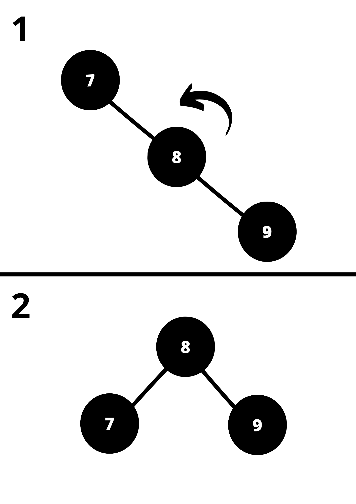

# Gerador de Árvores para Texto

#### Algoritmos e Estrutura de Dados 2

#### Desenvolvido em

  

## Índice
 - [Introdução](#Introdução)

 - [Fundamentação Teórica](#fundamentação-teórica)
    - [Estruturas de Dados](#estruturas-de-dados)
        - [Árvores](#árvores)
            - [Árvore Binária](#árvore-binária)
            - [Árvore AVL](#árvore-avl)
            - [Árvore de Huffman](#árvore-de-huffman)
 - [Objetivo](#Objetivo)
 - [Metodologia](#Metodologia)
    - [Arquivos](#Arquivos)
        - [Entradas](#Entradas)
        - [Funcionamento](#funcionamento)
            - [Primeira Leitura do Arquivo](#1-primeira-leitura-do-arquivo)
            - [Casos Especiais](#11-casos-especiais)
            - [Construindo Hash](#2-construindo-a-hash)
            - [Construindo Heap](#3-construindo-o-heap)
                - [Heap Mínimo dos Maiores Valores](#31-heap-mínimo-dos-maiores-valores)
            - [Ordenando o Heap](#4-ordenando-o-heap)
            - [Construção das Árvores](#5-construção-das-árvores)
            - [Saída](#6-saída)
    - [Conclusão, Reflexões e Aprendizados](#conclusão-reflexões-e-aprendizados)
        - [Diferentes Usos de Árvores](#diferentes-usos-de-árvoress)
        - [O Potencial da Árvore de Huffman](#o-potencial-da-árvore-de-huffman)
- [Compilação e Execução](#Compilação-e-Execução)
- [Ambiente de Desenvolvimento](#Ambiente-de-Desenvolvimento)

- [Referências](#Referências)

  

## Introdução
Este repositório apresenta  a solução para um problema proposto na disciplina de Algoritmos e Estruturas de Dados 2. Para isso foi requisitado que a implementação [TopK Heap]() tivesse complemento em suas funcionalidades. Sendo assim, este deveria além de criar um Heap com as 20 palavras mais frequentes e  árvores binárias, AVL e de Huffman para cada tipo de arquivo de entrada solicitato. Além de tudo deve-se criar uma de cada uma das estruturas, com excessão do Heap, para cada palavra de entrada se relacionando à cada uma das amostras de texto a serem lidas. Para isso considere as seguintes colocações:

- Nomes de diretórios, ou arquivos serão referênciados da seguinte forma: `Nome.txt` ou `Diretório_2`.

- Nomes de variáveis: _`a`_, _`b`_.

- Nomes de funções: **`xpto()`**, **`sum()`**.

- $n$ - Número de nós em uma árvore qualquer.

- **_Ramificação_** - Sub árvore esquerda que divide nó pai com uma sub árvore direita. Ou sub árvore direita que divide nó pai com uma sub árvore esquerda.

- $h_{folhas}$ - Altura de uma dentre quaisquer folhas pertencentes à uma árvore qualquer.

- $r$ - A raíz de um $He$

- $He$ - Um Heap qualquer.

- $Ha$ - Uma Hash qualquer.

- $K$ - Número de palavras pertencentes ao ranking das palavras mais citadas, ou , tamanho do $He$ utilizado na implementação

- Nomes de comandos digitados no terminal,funções ou variáveis serão referênciados da seguinte forma: _**touch main.cpp**_, _**make run**_.

## Fundamentação Teórica
Para contextualizar o funcionamento do algoritmo, considere como entrada textos armazenados em arquivos sem nenhuma formatação(Arquivo ASCII) onde cada sentença termina por um sinal de pontuação (".", "?", "!"):
    - Uma palavra é uma sequência de letras delimitada por um espaço em branco, "coluna da esquerda", "coluna da direita" e símbolos de pontuação.
    - Stop words são palavras que desconsideradas na leitura do arquivo de entrada.
- Ao final da execução do programa é esperado que a saída mostre uma relação entre a estrutura de árvore modelada em função de uma combinação entre uma amostra de leitura(arquivos de texto em `/dataset`) e uma palavra de entrada (palavras em `/dataset/input.txt`), ou seja, como os nós da árvore estão disposotos ao considerar uma palavra de entrada durante sua construção na leitura de um exemplar de texto.

### Estruturas de Dados
Para solucionar o problema a alocação dos valores de entrada devem ser construídas árvores diversas. É importante saber que o primeiro nó inserido na árvore binária e na avl são sempre a raíz destas, porém na 
árvore de Huffman isso é diferente.

#### Árvores
- As árvores são contribuição essencial para a computação uma vez que tem o potencial de facilitar a resolução de diversos tipos de problemas com seu uso. Para Rosen(2012, p. 757–769) sendo assim as árvores tem tipos que se classificam de acordo com o tipo de problemática que elas abordam, sendo estes tipos nomeados como: árvores de pesquisa, árvores de decisão, árvores de códigos livres de prefixo e árvores de jogos.

- As árvores de pesquisa tem como propósito armazenar dados em seus nós. E é escolhida como estrutura de dados com a finalidade de minimizar custos em casos onde segundo Pires (2023, p.3)"o conteúdo do arquivo é estavel, ou seja, não sofre muitas modificações ao decorrer do tempo, torna-se mais importante minimizar o tempo de pesquisa sem a necessidade de se preocupar com o tempo gasto na estruturação do arquivo". Em síntese, estas são estruturas de dados que favorecem sistemas onde a pesquisa é mais realizada que a inserção, remoção e alteração dos dados.

- As árvores de decisão são utilizadas como um TAD(Tipo Abstrato de Dados), para modelar problemas onde uma série de decisões podem levar à uma solução. Essas estruturas terão todas as possiblidades de decisão em todos os seus nós, estes nós se ramificam em subdecisões de forma que estas ramificações dependam da decisão presente em seu nó pai para serem realizadas. Observe um exemplo de árvore de decisão dado o problema de identificar objetos.

 
<strong> Objetos </strong>
 

 
Fonte: Disponível no <a href = "https://edisciplinas.usp.br/pluginfile.php/4469825/mod_resource/content/1/ArvoresDecisao_normalsize.pdf">link</a>.
 

 
<strong> Árvore de Decisão </strong>
 

 
Fonte: Disponível no <a href = "https://edisciplinas.usp.br/pluginfile.php/4469825/mod_resource/content/1/ArvoresDecisao_normalsize.pdf">link</a>.
 

 

- As árvores de códigos livres de prefixo são árvores que estabelecem relações entre um código de caracter e um caracter por exemplo. Isso significa que essas relações não permitem ambiguidade, de forma que uma sequência de símbolos seja associada à outra sequência exclusiva que representa os mesmos. Veja um exemplo associado ao uso do algoritmo de Huffman.

#### Tabela de Conversão
<table>

<tr>
<td colspan = '1'><strong>Cadeia de Caracteres</strong></td>
<td align = "center" colspan = '1'><strong>Binário Correspondente</strong></td>
</tr>

<tr>
<td align="center">A
</td>
<td align="center">10</td>

</tr>

<tr>
<td align="center">B</td>
<td align="center">011</td>

</tr>

<tr>
<td align="center">C</td>
<td align="center">00</td>
</tr>

<tr>
<td align="center">D</td>
<td align="center">110</td>
</tr>

<tr>
<td align="center">E</td>
<td align="center">111</td>
</tr>

<tr>
<td align="center">F</td>
<td align="center">010</td>
</tr>

<tr>
<td align="center">FACA</td>
<td align="center">010100010</td>
</tr>

<tr>
<td align="center">FADA</td>
<td align="center">0101011010</td>
</tr>

<tr>
<td align="center">CABE</td>
<td align="center">0010011111</td>
</tr>

<tr>
<td align="center">CEDA</td>
<td align="center">0011111010</td>
</tr>

</table>

- As árvores de jogos modelam alguns tipos de jogos, considerando que estes se classificam como jogos de dois jogadores, onde cada um destes tem completo conhecimento dos aspectos que esse jogo toma durante toda a partida. Classificados como jogos combinatórios por Fava(2018, p. 1), estes tipos normalmente são jogados em turnos e não envolvem elementos de probabilidade, alguns exemplos são Xadrez e Damas. Considerando que as jogadas são deterministicas e não probabilísticas, estes jogos também são caracterizados como equânimes ou imparciais e é isso que permite com que a árvore seja atribuída à eles. Veja a abstração de um turno de jogo da velha modelado por uma árvore de jogos.

 
<strong> Árvore de Jogos </strong>
 

 
Fonte: Disponível no <a href = "https://iq.opengenus.org/game-tree/">link</a>.
 

##### Árvore Binária
As estruturas utilizadas para armazenar os números no programa criado são árvores binárias e árvores AVL. Portanto compreende-se que uma árvore binária é uma esturutra composta por diversos nós. Cada nó da árvores binária armazena um número. Os nós das árvores binárias se organizam localmente de modo que um nó pai tenha um, dois ou nenhum pai filho. Quando um número é gravado em um nó à direita de outro, este terá valor maior que a o mesmo.Já quando um valor é gravado no nó à esquerda do atual, significa que o atual tem valor maior que aquele. Os últimos nós inseridos em uma árvore estão próximos às folhas e os primeiros mais próximos à raíz.

 
<strong> Árvore Binária </strong>
 

 
A forma final de uma árvore binária independe da ordem com que os elementos serão inseridos.
 
Fonte: Construção pelo autor.
 

##### Árvore AVL
 Diferente da árvore binária árvores AVL(Adelson Velsky and Landis) tem sua forma final enviesada pela ordem de inserção das entradas. Isso acontece pelo fato de que árvores AVL terem métodos que tentam manter todas as folhas em mesma altura.

 O custo de pesquisa partindo da raíz até um nó folha na árvore está próximo de $\log_{2}(n)$, mas isso é verdade apenas quando as alturas também se aproximam o suficiente. O suficiente para os métodos que balanceiam as árvores é permitir que $h_{folhas} \leq 1$.

Para que a árvore tenha essas caracterísitcas, rotações são feitas na árvore AVL. Quando $|h_{1folhas} - h_{2folhas}| = 2$ o algoritmo identifica o lado da **_Ramificação_** de maior profundidade em relação ao pai. Entenda mais sobre as rotações nas imagens abaixo:

 
<strong> Rotação para Esquerda </strong>
 

 
Acontece quando a <strong><i>Ramificação</i></strong> direita é mais profunda que a esquerda em 2 nós.
 
Fonte: Construção pelo Autor.
 

 
<strong> Rotação para Direita </strong>
 

 
Acontece quando a <strong><i>Ramificação</i></strong> esquerda é mais profunda que a direita em 2 nós.
 
Fonte: Construção pelo Autor.
 
 
 

 Nos outros dois casos abaixo, são aplicadas respectivamente:
1. uma rotação à esquerda é aplicada em todos os nós e depois uma direita é aplicada apenas ao nó direito.

2. uma rotação direita é aplicada à todos os nós e depois uma esquerda é aplicada apenas ao nó esquerdo.

 
<strong> Casos de Rotações Duplas </strong>
 

 
Acontece quando a <strong><i>Ramificação</i></strong>
 
Fonte: Construção pelo Autor.
 

##### Árvore de Huffman
A árvore de Huffman é um algoritmos que usufrui da estrutura de dados de árvore como uma estrutura auxiliar. O propósito da Árvore de Huffman é criar uma árvore que associe os símbolos mais frequentes de uma string à um número binário que exija armazenamento inversamente proporcional às suas repetições. 

A árvore de Huffman permite primeiramente identificar a frequência de um símbolo(computada dividindo o número de vezes que o símbolo aparece pelo tamanho da string) em uma string. Para entender melhor volte ao exemplo de [árvores de prefixo](#tabela-de-conversão) mostrado acima. Acompanhe a execução do algoritmo dado um arranjo de palavras "FACAFADACABECEDA":

 
<strong> 1º Passo </strong>
 

 

 Cálculo da frequência de cada símbolo

 
Fonte: Construção pelo Autor.
 

 
<strong> 2º Passo </strong>
 

 

 Cálculo da frequência de cada símbolo

 
Fonte: Construção pelo Autor.
 

 
<strong> 3º Passo </strong>
 

 

 Formam-se duas <strong><i>Ramificações</i></strong> com os outros nós 

 
Fonte: Construção pelo Autor.
 

 
<strong> 4º Passo </strong>
 

 

 Uma única árvore é formada à partir das <strong><i>Ramificações</i></strong> 

 
Fonte: Construção pelo Autor.
 

## Objetivo
A implementação visa realizar a construção das estruturas de dados: árvore binária, AVL e de Huffman. À partir da construção destas, o programa deve escrever em um arquivo de saída os valores contidos na árvore de forma à especificar as devidas palavras referidas sob as quais as árvores foram construídas.

## Metodologia
A construção do código de Huffman não foi realizada, mas as demais estruturas de dados sim.

### Arquivos
Para resolução da proposta fora utilizados os seguintes arquivos:

- `dataset/filosofia.txt` e `dataset/filosofia2.txt`: Arquivos que contém textos de entrada relacionados à filosofia.

- `dataset/globalizacao.txt`: Arquivo que contém textos de entrada relacionados à globalização.

- `dataset/input.txt`: Arquivo que contém palavras de entrada à serem desconsideradas na construção das árvores.

- `dataset/outputs.txt`: Arquivo onde as saídas, ou seja, as construções das árvores serão escritas.

- `dataset/politica.txt`: Arquivo que contém textos de  entrada relacionados à política.

- `dataset/Stopwords.txt`: Um arquivo que contém palavras à serem desconsideradas e ignoradas pela proposta.

- `dataset/ti.txt` e `dataset/ti2.txt`: Arquivos que contém textos de entrada relacionados à tecnologia da informação.

#### Entradas

 
  
<code><strong>input.txt</strong></code> 
 
 

 
 
Fonte: Captura de tela da máquina do autor.
 

 
 
 <code><strong>filosofia.txt.txt</strong></code> 
 
 

 
 
Fonte: Captura de tela da máquina do autor.
 

 
 
 
<code><strong>ti.txt</strong></code> 
 
 

 
 
Fonte: Captura de tela da máquina do autor.
 

### Funcionamento
#### 1. Primeira Leitura do arquivo
- As leituras dos arquivos de entrada são configuradas através dos elementos de um vetor com paths nos arquivos `main.cpp` e `Palavras.hpp`. Os elementos contidos nessa variável são os nomes dos arquivos de entrada.

#### 1.1. Casos Especiais
- Os casos especiais são quando o arquivo não pode ser lido, assim como especificado no trabalho pela seleção dos [Top K elementos em um Heap](#https://github.com/jAzz-hub/TopK_Heap/tree/main).

#### 2. Construindo a Hash
 - Em seguida é criada uma hash utilizando a função **`fileReader()`**, recebendo como parâmetro o caminho até as entradas, e um vector de strings denominado **`words`**, a função usa o arquivo de entrada para criar a hash retornando um unordered_map e modificando a variável **`words`**. O unordered_map é armazenado na variável **`hashwords`** uma $Ha$ com chaves iguais à cada elemento em **`words`**, são estas strings com cada palavra no arquivo de entrada. Além disso tudo vale ressaltar que as chaves contidas em **`hashwords`** são palavras que não estão contidas no arquivo `Stopwrods.data`, para entender melhor como isso é feito, basta ler a documentação das funções **`isStopWord()`** e **`readStopWordsFile()`**. Caso queira entender como o processo de Hashing funciona em no unordered_map basta retornar à [Algoritmos](#murmurhashunaligned2)

#### 3. Construindo o Heap
 - O construtor do heap é chamado, depois este é preenchido com os valores da hash através da função **`fill_the_heap()`**. O heap tem tamanho $K$ que no código pode ser configurado alternado o valor da constante de nome K contida no arquivo `StructuresAndSignatures.hpp`. Portanto o heap inicialmente tem os primeiros $K$ elementos contidos em $Ha$.

 #####  3.1. Heap Mínimo dos Maiores Valores
 - Para construção de um $He$ Mínimo de forma que o a palavra menos citada entre as mais citadas se encontre em $r$, o seguinte acontece:    
    
    - 1. A função **`bigger_value_researcher`** é chamada.

    - 2. Dentro da função é chamada a função **`pile_the_Heap()`**, esta executa uma algoritmo de min-Heapify. Em outras palavras, a função percorre $He$ da sua metade até o primeiro elemento, enquanto isso acontece a função **`organize()`** é executada à cada iteração do laço.

    - 3. **`organize()`** verifica quem é menor entre o nó pai e os nós filhos em relação ao índice atual. O menor valor entre os nós é trocado de índice com o nó pai.
    
    - 4. Ao fim da execução de **`pile_the_Heap()`** o menor valor se encontra na raíz do $He$. Ao fim da primeira execução dessa função, um laço de iteração é criado para percorrer $Ha$.
    
    - 5. Percorrendo $Ha$ à partir do elemento no índice $K$ o algoritmo verifica se o elemento atual de ${h}_i$ é maior que $r$, caso seja, $r$ se torna igual à ${h}_i$.

    - 6. A função **`pile_the_Heap()`** é chamada ao fim de cada iteração.

    - 7. Ao final do laço de execução a função **`bigger_value_researcher()` é finalizada. Dito isso, $He$ terá as $K$ palavras mais citadas da entrada que foi passada para construção de $Ha$.

#### 4. Ordenando o Heap

- O método de ordenação escolhido para obter um saída dos elementos em $He$ de forma crescente foi o Insertion Sort, chamado pela função **`InsertionSort()`**, pelo fato de que este método é executado com custo computacional linear quando a entrada está parcialmente ordenada. No caso de $He$, há elementos parcialmente ordenados devido às sucessivas chamadas de **`pile_the_Heap()`**. Além para Cunha, Ítalo(2012, slide 8)⁷:
    - 1. É o método mais interessante para entradas com menos de 20 elementos($He$ tem 20 elementos).
    - 2. É estável(não realiza troca de índices entre elementos de mesmo valor).
    - 3. É facilmente implementado.

- Por dizer que o vetor está parcialmente ordenado considere dizer que há uma sequência de elementos maior que um par ordenado partindo do índice 0. Já em um vetor ordenado aleatoriamente, considere que no índice 0 pode haver um valor maior que um par ordenado em índices maiores. A diferenciação colocada é essencial pelos seguintes motivos. Para Drozdek(2016, p.426)⁹ o que acontece se os dados estão em ordem aleatória o esforço de ordenação pela máquina é de $O(K²)$, sendo este o custo igual ao do pior caso. Já para Costa, Y. M. G. o custo é sempre muito baixo em casos de vetores parcialmente ordenados⁸, sendo este um custo que se aproxima do melhor caso, ou seja, $O(K)$ Para ter uma perspectiva mais detalhada desse processo, acesse este [repositório](#https://github.com/jAzz-hub/TopK_Heap/blob/main/README.md).

#### 5 Construção das Árvores
A definição das estruturas utilizadas estão nos arquivos `AVL.cpp`, `AVL.hpp`, `BTree.cpp` e `BTree.hpp`. Sendo B uma abreviação para _binary_ neste caso. Após toda a construção dos heaps em `everythingForEachInput()`, `make_the_trees()` usa o heap construído para criar as árvores binárias e AVL. As árvores são construídas simultaneamente, crescendo em um laço de repetição que itera a heap.

#### 6. Saída
A `função write_the_trees()` receberá as árvores após construídas, posteriormente estes dados são escritos no arquivo `output.txt`, dada esta [entrada](#entradas).

 
 
<code><strong>outputs.txt</strong></code> 
 
 

 
 
Fonte: Captura de tela da máquina do autor.
 

## Conclusão, Reflexões e Aprendizados
- Durante o estudo, apesar da implementação incompleta, foi possível compreender muito bem o contexto de uso de cada uma das árvores estudadas. Mais especificamente quais tipos de problemas cada uma delas resolvem.

### Diferentes Usos de Árvores
- As árvores podem ter diversas formas de uso como estruturas auxiliares de dados. Quando precisam armazenar números de forma à manter um balanceamento, à fim de reduzir custos AVL pode servir muito bem. Porém utilizar uma árvore binária como árvore de decisão pode fazer com que seu uso também seja importante, não limitando todos os usos à árvore AVL. O maior foco do trabalho foi nessas duas estruturas, porém sabe-se que as demais árvores apresentadas tem grande importância em demais contextos de aplicação.

### O Potencial da Árvore de Huffman
- Além de tudo pode ser aprendido que a árvore de Huffman é útil na compressão de informações. De forma que uma palavra de 32 bytes, ou seja, 4 caracteres, pode passar a ocupar apenas 8 bytes(se cada letra puder ser encriptada por 2 bits pela Árvore de Huffman) quando armazenada em binário. 

## Compilação e Execução
Para compilação e execução do código é necessário que seja criado um arquivo Makefile. Para uso deste arquivo da forma correta, siga as diretrizes de execução abaixo:

<table>

<tr>
<td colspan = '1'><strong>Comandos</strong></td>
<td align = "center" colspan = '1'><strong>Funções</strong></td>
</tr>

<tr>
<td align="center"><strong><i>make clean</i></strong>
</td>
<td align="center">Deleta o arquivo executável e todos os arquivos objetos do diretório. (FREE SOFTWARE FOUNDATION, GNU make, 2023)</td>
</tr>
<tr>
<td align="center"><strong><i>make</i></strong></td>
<td align="center">Compila diferentes partes do programa através do g++ e cria um arquivo executável na pasta build. </td>
</tr>
<tr>
<td align="center"><strong><i>make run</i></strong></td>
<td align="center">Executa o programa da pasta build após a realização da compilação. (PIRES, MICHEL, 2023)</td>
</tr>
</table>

## Ambiente de Desenvolvimento:
O código foi desenvolvido e testado no seguinte ambiente de desenvolvimento:

<table align="center">
<tr>
<td colspan = '1' align="center"><strong>Peças</strong></td>
<td align = "center" colspan = '1'><strong>Especificações</strong></td>
</tr>

<tr>
<td align="center"><strong><i>Processador</i></strong>
</td>
<td align="center">Intel(R) Core(TM) i5-3340M CPU @ 2.70GHz</td>
</tr>
<tr>
<td align="center"><strong><i>Memória RAM</i></strong></td>
<td align="center">8 GB </td>
</tr>
<tr>
<td align="center"><strong><i>Sistema Operacional</i></strong></td>
<td>Debian GNU/Linux 11 (bullseye)</td>
</tr>
</table>

  

## Referências

[1] H. ROSEN, K. DISCRETE MATHEMATICS AND ITS APPLICATIONS. 7. ed. Avenue of the Americas, New York, NY 10020: McGraw-Hill, 2012. p. 757–769

[2] PIRES, MICHEL. Algorítmos e Estrutura de Dados II. Disponível em: <https://ava.cefetmg.br/pluginfile.php/165783/mod_resource/content/6/Aula1.pdf>. Acesso em: set. 24DC.

‌[3]LAURETTO, M. Árvores de Decisão 1 Definições 1.1 Aprendizado Supervisionado. [s.l: s.n.]. Disponível em: <https://edisciplinas.usp.br/pluginfile.php/4469825/mod_resource/content/1/ArvoresDecisao_normalsize.pdf>.

[4]FAVA, M. What is... Game Theory. Disponível em: <https://math.osu.edu/sites/math.osu.edu/files/What_is_2018_Game_Theory.pdf>. Acesso em: set. 24DC.

[5] GNU make. Disponível em: <https://www.gnu.org/software/make/manual/make.html>. Acessado em 27 de Agosto de 2023.

[6] GNU Make. Disponível em: <https://www.gnu.org/software/make/>. Acesso em: ago. 27.

## Contato
 

 
 

 
 

✉️ <i>joaogu.2001@gmail.com</i>

</a>

